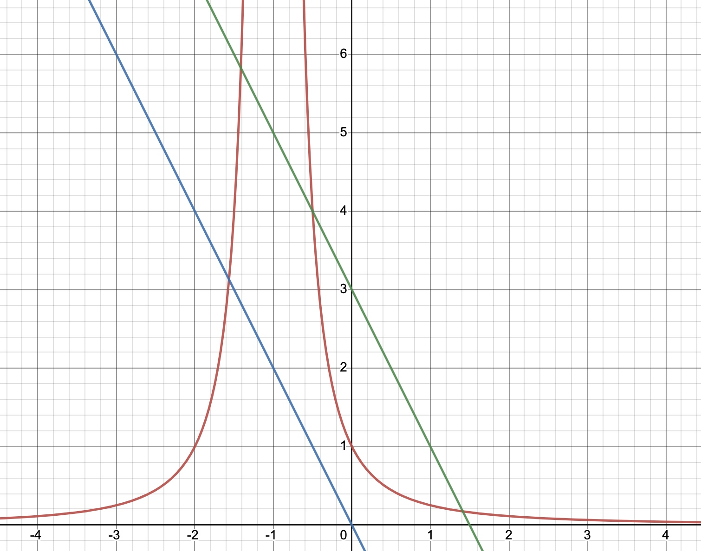
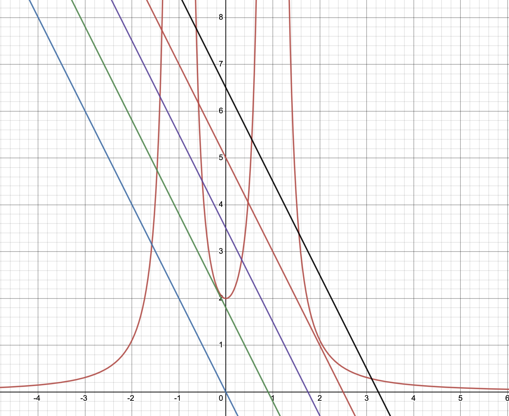
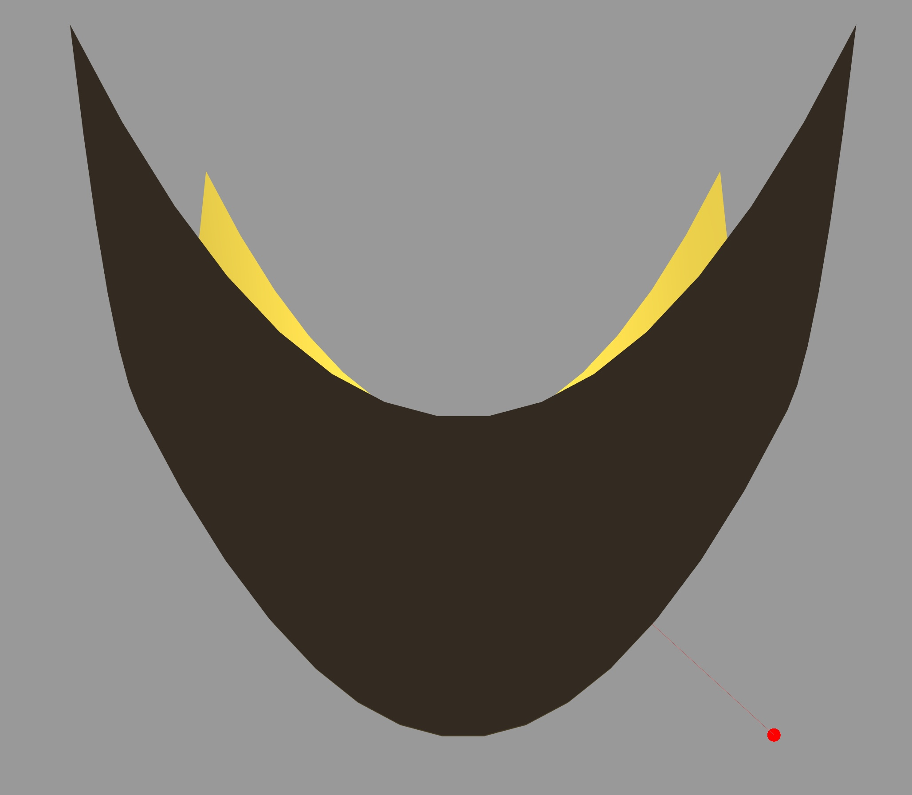
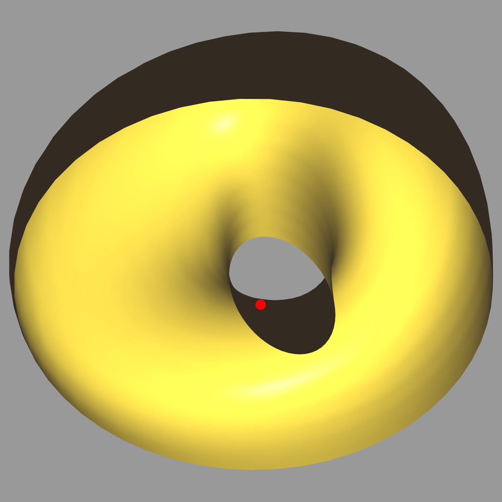

# Assignment 1

#### Question 1

- (a) Assuming the normal of point $\mathbf{x}^0=(\mathbf{x}^0_1, \mathbf{x}^0_2, \mathbf{x}^0_3)$ on the paraboloid  passes through $\mathbf{p}$. Then, we can derive the normal direction as: $\frac{\mathbf{x}^0-\mathbf{p}}{\left\| \mathbf{x}^0-\mathbf{p} \right\|}$.
  Mathematically, the normal at point $\mathbf{x}^0$ is defined as: $\mathbf{n}=\pm \frac{\nabla f\left(\mathbf{x}^0\right)}{\left\|\nabla f\left(\mathbf{x}^0\right)\right\|}$.

    The partial derivatives of $f$ at $\mathbf{x}^0$ is $(2a\mathbf{x}^0_1, 2b\mathbf{x}^0_2, -2)$. Thus, the equation of the normal line is:
    $$
    P(t) = (\mathbf{x}^0_1, \mathbf{x}^0_2, \mathbf{x}^0_3) + t(2a\mathbf{x}^0_1, 2b\mathbf{x}^0_2, -2)
    $$

    Since the normal line passes through $\mathbf{p}$, we obtain the following system of equations:
    $$
    \begin{aligned}
        (1+2at)\mathbf{x}^0_1 & = p_1 \\
        (1+2bt)\mathbf{x}^0_2 & =  p_2\\
        \mathbf{x}^0_3 - 2t & =  p_3
    \end{aligned}
    $$

    The solution(s) to the system of equations are $\mathbf{x}^0=(\frac{p_1}{1+2at}, \frac{p_2}{1+2bt}, p_3+2t)$

- (b) The number of solutions depends on the value of $\mathbf{p}$ and $a, b$.
    Since $\mathbf{x}^0$ is on the paraboloid, the following equation should be satisfied:
    $$
     2(p_3+2t)=a(\frac{p_1}{1+2at})^2 + b(\frac{p_2}{1+2bt})^2
    $$

    It's obvious that **the number of solutions is the number of intersections** the linear function on the LHS has with the combined two power functions on the RHS.
    - Let's assume $a, b \neq 0$ and $a\neq b$.
      - when $p_1=p_2=0$:
        - the equation is reduced to $2p_3+4t=0$, which is  linear function and has one unique solution $\mathbf{x}^0 = (0, 0, 0)$
      - when $p_1=0$ or $p_2=0$:
        - the RHS is left with one power function and the number of solutions could be one or two depending on the exact value of variables. An illustration is shown below.
        
    - Now, let's assume $p_1, p_2 \neq 0$. The number of solutions is now controlled by $a, b$.
      - when $a=b$:
        the two power functions has the same base and therefore are combined into one function. The number of solutions is still one or two depending on the location of $\mathbf{p}$.
      - when $a=0$ or $b=0$:
        the RHS has only one power function and the number of solutions is one or two as illustrated above
      - otherwise:
        there're two power functions on the RHS and the number of solutions vary from one to five depending on the exact value of variables. The following firgue shows different situtations that leads to varying number of solutions.
        
    - Another case is that $a=0$ and $p_2=0$, or $b=0$ and $p_1=0$,
      - the equation is also reduced to $2p_3+4t=0$, which is  linear function and has one unique solution $\mathbf{x}^0 = (0, 0, 0)$

- (c) Run the `HW1/hw1.py` and set the file_obj = join(os.getcwd(), "HW1/mesh/paraboloid.obj") to view the result. A screenshot is given as follows. 

#### Question 2
- Run the `HW1/hw1.py` and set the file_obj = join(os.getcwd(), "HW1/mesh/birdnet_quad.obj") to view the rsesult. A screenshot is given as follows. 