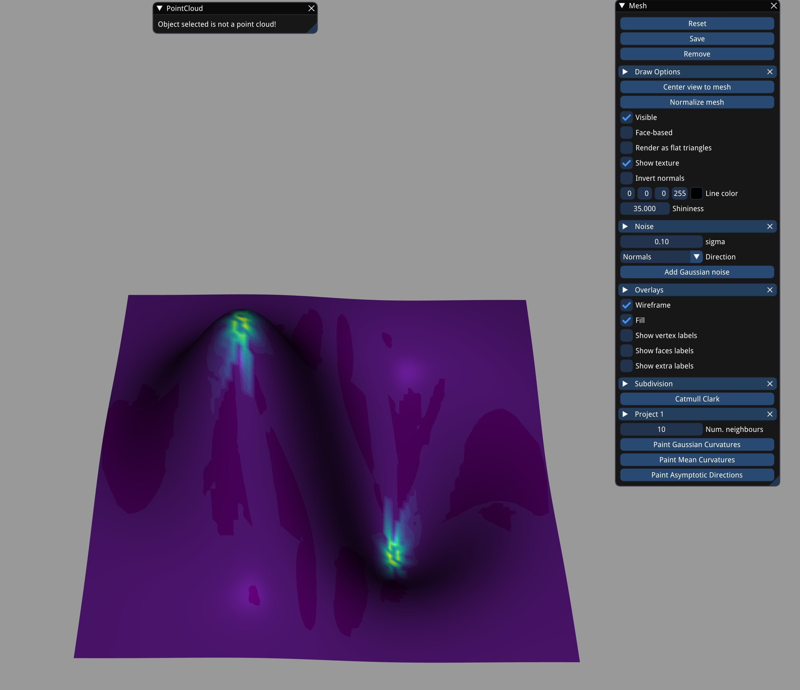
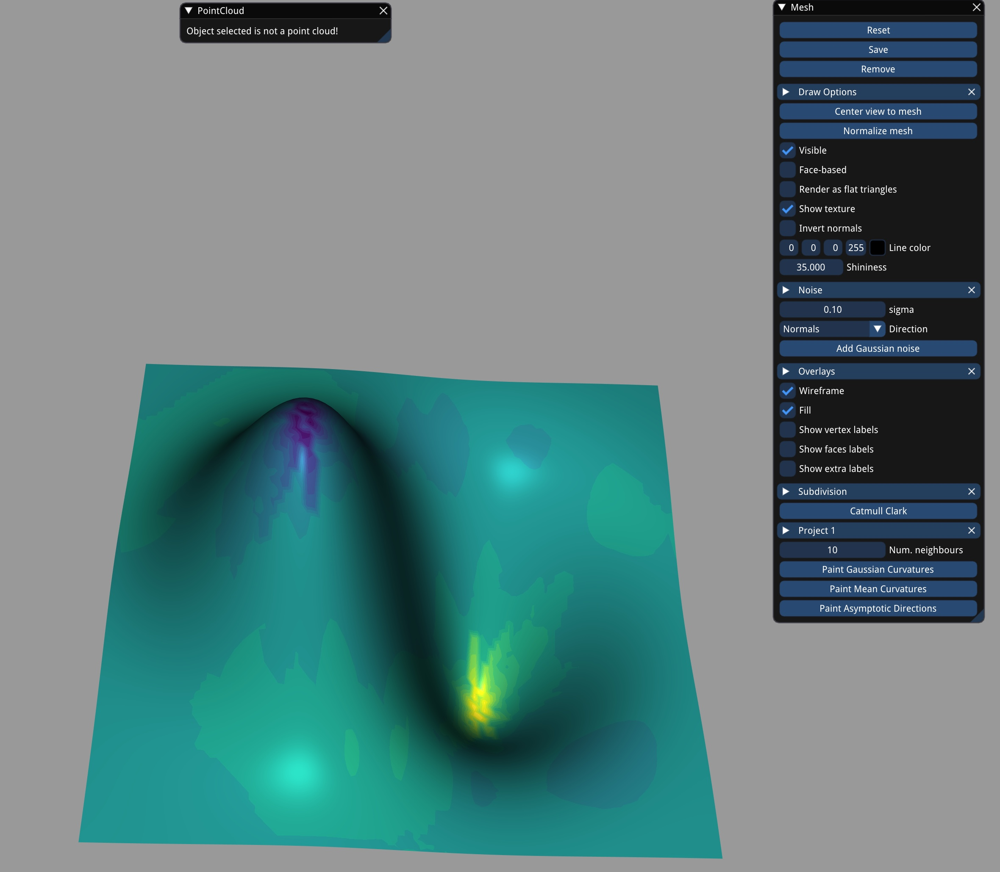
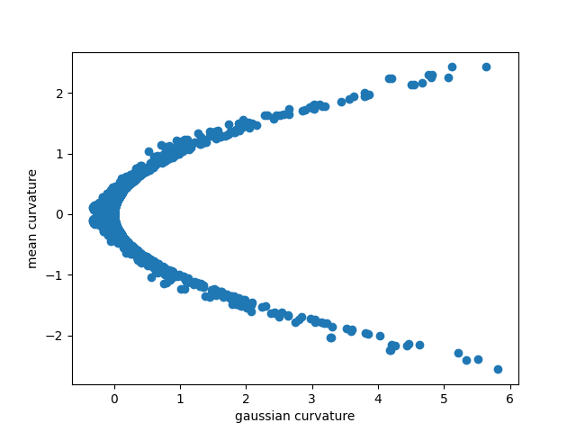

# Assignment 2

## Question 1
#### Run
- Run the `HW2/hw2.py` and set the file_obj to any file in the ExerciseData directory. To check the Gaussian curvatures or the Mean cuevature, click `Paint Gaussian Curvatures` or `Paint Mean Curvatures` button on the GUI. It takes roughly 3 min to process.
- Once we get the curvature on the GUI, a `curvature.npy` file will also be saved to the working directory. Run the `HW2/curvature_analysis.py` and you can view the curvature values in the (H, K) plane.

#### Explanation
- The curvature estimation contains 4 steps:
  - Step1: find k neighbors of each vertex
    To get a nice curvature, we should tune the value of k in `framework/viewer/widgets/MeshWidget.py`. Here I choose k=10 to keep a balance between estimating time and curvature smoothness.
  - Step2: convert points into the Cartesian coordinate system
  - Step3: fit points to $z = a_0 + a_1 x + a_2 y + a_3 x^2 + a_4 xy + a_5 y^2$
    In this step, I use the SciPy to solve the square fitting problem. We can definitely switch to matrix operations to speed up the computation.
  - Step4: plot curvature values in the (H, K) plane

#### Result
Plots of Guassian and Mean curvatures, and the curvature values in the (H, K) plane are shown below.

