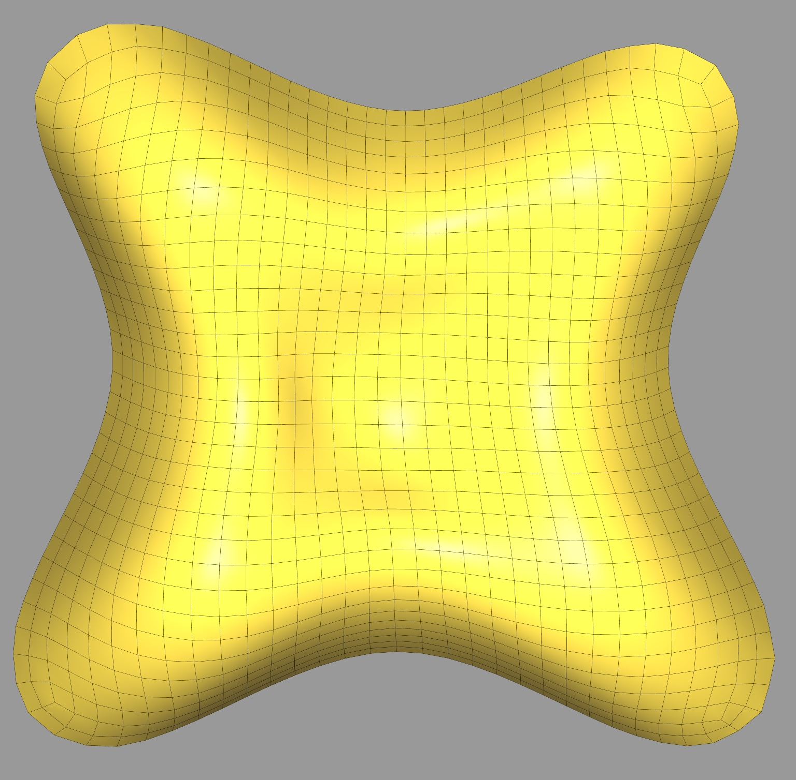
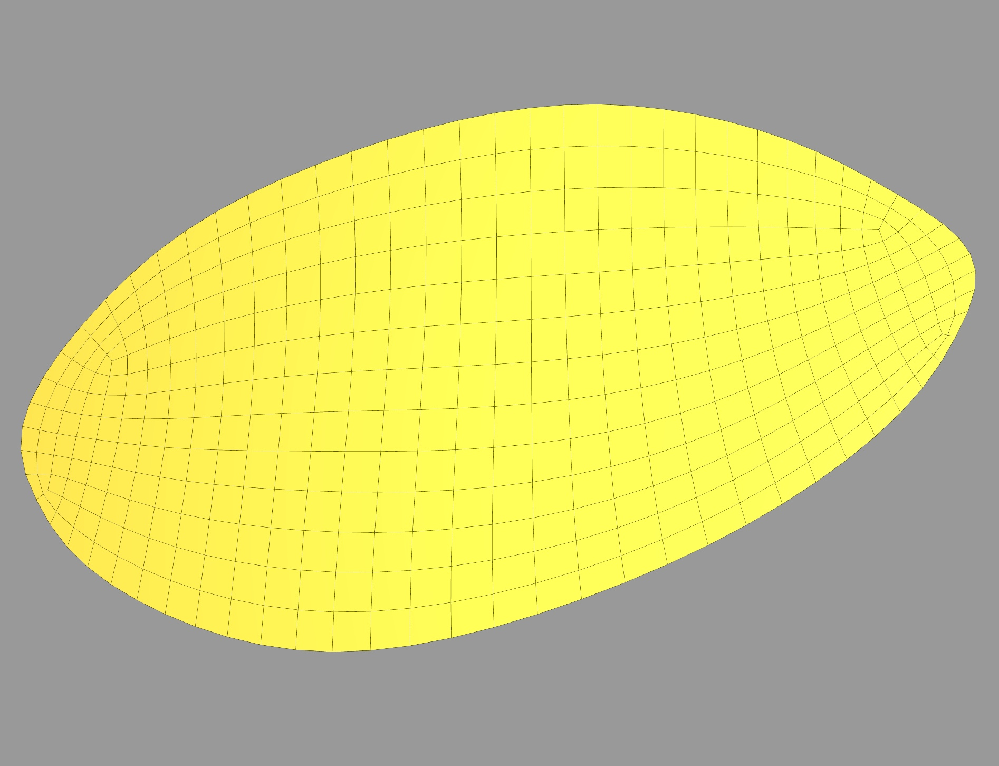

# Assignment 3

## Question 1
#### Run
- Run the `HW3/hw3.py` and set the file_obj to any file in the mesh directory. To perform the mesh parameterization, click `Mesh Parameterization` button on the GUI.
- Once the mesh parameterization is finished, a new mesh that is mapped to the xy-plane is generated and it replaces the original mesh.
- The x and y values of vertices on the newly generated mesh should be assigned to uv values of the original mesh to show the texture. However, due to the time limit, this is not implemented.

#### Result
Plots of mesh before and after mesh parameterization
1. lilium_quad
    
    
2. formfinding-circular
    
    