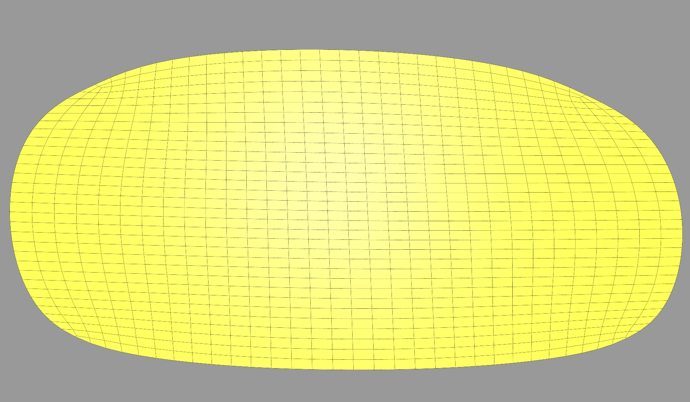
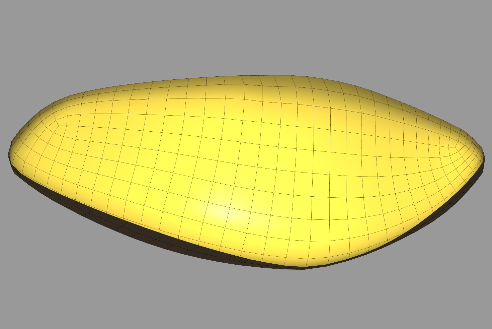
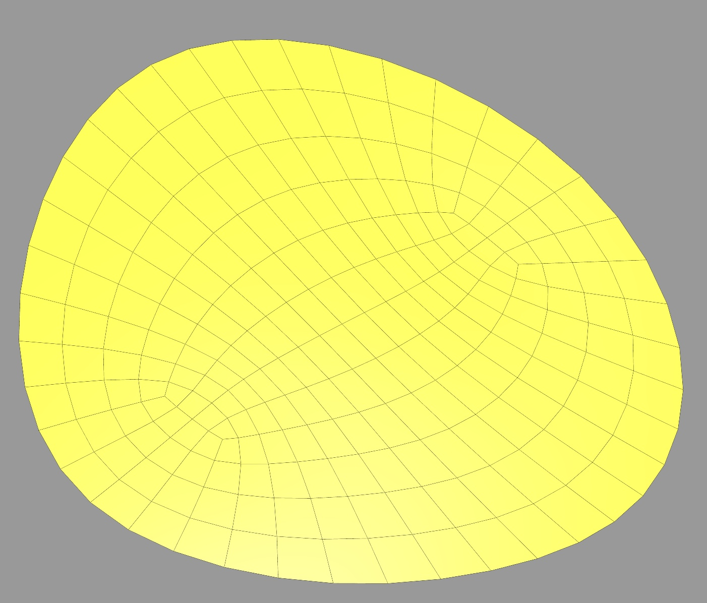

# Assignment 3

## Question 1
#### Run
- Run the `HW3/hw3.py` and set the file_obj to any file in the mesh directory. To perform the mesh parameterization, click `Mesh Parameterization` button on the GUI.
- Once the mesh parameterization is finished, a new mesh that is mapped to the xy-plane is generated and it replaces the original mesh.
- The x and y values of vertices on the newly generated mesh should be assigned to uv values of the original mesh to show the texture. However, due to the time limit, this is not implemented.

#### Explanation
The mesh parameterization is to map a mesh into the plane by a conformal and as-isometric-as-possible map. In order to achieve conformal mapping, we need to minimize the conformal energy in the new mesh, $E_{conf }=\sum_{f \in F} \sum_{j=1}^3 c_{c o n f, j}(f)^2$. To make the mapping as isometric as possible, the lambda energy, $E_\lambda=\sum_{f \in F}\left(\lambda_f-1\right)^2$, should also be minimized. In addition, to prevent zigzagging of mesh polylines, the fairness functional, $E_{fair, M}=\sum_{\substack{v_i v_j v_k \text { successive vertices in M}}}\left\|v_i-2 v_j+v_k\right\|^2$, is also added to the objective function.
Finally, the objective of the optimization is as follows:
$$
\text{min} \quad w_{conf } E_{conf} + w_\lambda E_\lambda + w_{fair} E_{fair}
$$

The optimization is implemented with Gauss Newton method with $w_{conf}$, $w_\lambda$ and $w_{fair}$ set to 1.

#### Result
Plots of mesh before and after mesh parameterization.
1. lilium_quad
     
2. formfinding-circular
     
3. 0-00_02_1-projected
     